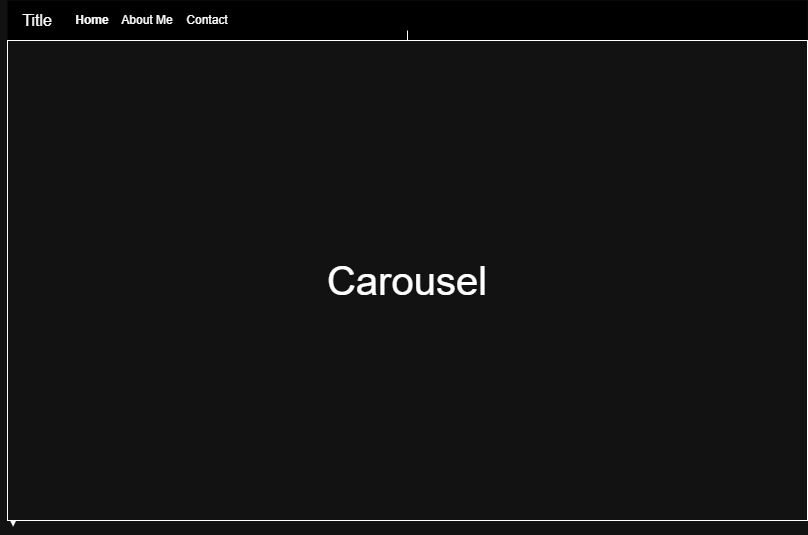
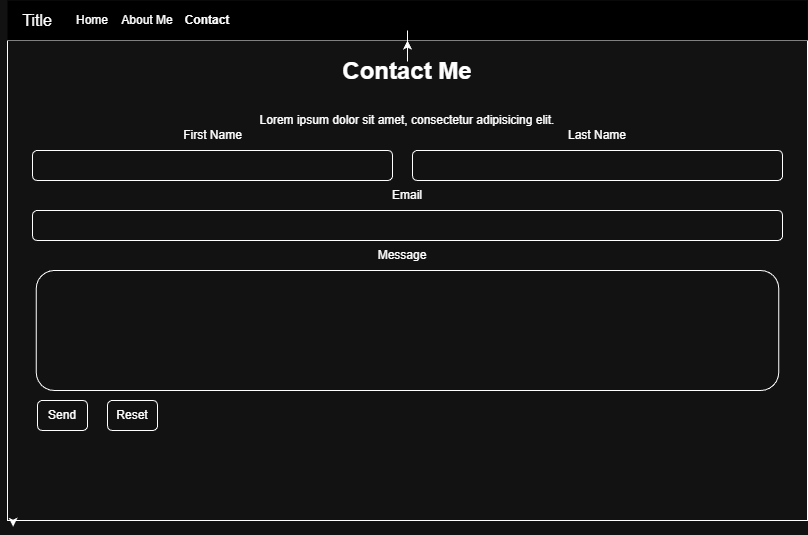
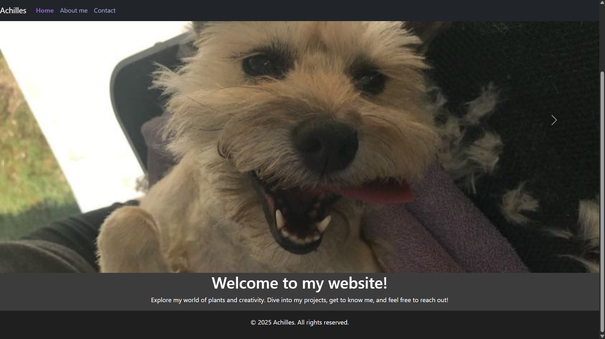
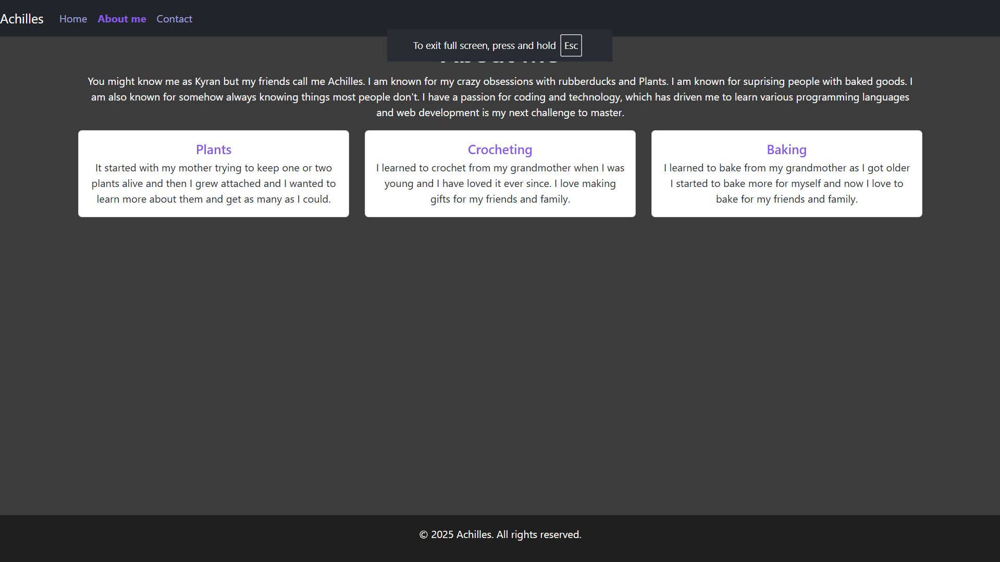
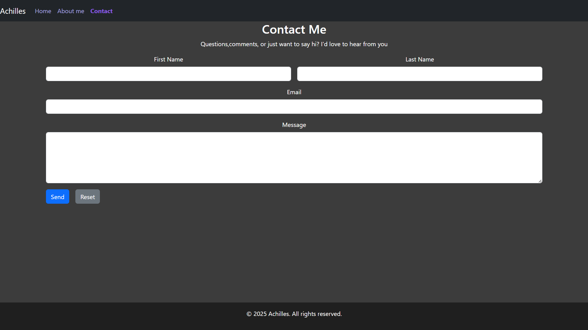

# Achilles -- A WEBSITE ABOUT ME

**Auther:** Kyran Detamore

A Multi-page website using **HTML**, **CSS**, and **Bootstrap 5.3.8**. It really just informs you more about me.

## Features

- Semantic HTML5 structure (header, nav, main, section, article, footer)
- Carousel (fade/auto) on home page

## Technologies

HTML5 • CSS3 • Bootstrap 5.3.8

## Future Improvments

1. Add a page that lets people know all the random facts I know
2. Add theme toggle with persisted preference.

## WireFrame

1. **built with draw.io**
2. 
3. 
4. 

## Snapshots

    
    
    

## User Story